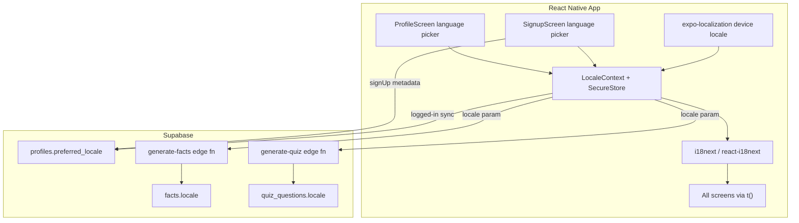

# DeFacto Internationalization (i18n)

Documentation for multi-language support in DeFacto.

## Overview

DeFacto supports **4 languages** in v1:

| Language | Code | Native name | Direction |
|----------|------|-------------|-----------|
| English (default + fallback) | `en` | English | LTR |
| Spanish | `es` | Español | LTR |
| French | `fr` | Français | LTR |
| Brazilian Portuguese | `pt-BR` | Português (Brasil) | LTR |

> Arabic support was removed: Arabic text rendered with clipped/missing glyphs in several screens, so RTL and the Noto Sans Arabic font were dropped from the app (see `supabase/migrations/20260626090000_remove_arabic_locale.sql`).

**Goals**

- Let users choose their preferred language at signup
- Let existing users change language from Profile
- Translate all app UI strings
- Generate facts and quiz content in the user's language

**Non-goals (v1)**

- Supporting all ~195 country languages
- Translating App Store listings (future work)
- Pre-translating existing English facts in the database

---

## Architecture



### Key files

| File | Purpose |
|------|---------|
| `src/i18n/index.js` | i18next init, locale resolver, language metadata |
| `src/locales/*.json` | Translation strings per language |
| `src/theme/LocaleContext.js` | Runtime locale state, SecureStore, RTL |
| `src/components/LanguagePicker.js` | Shared modal for language selection |
| `supabase/migrations/*_add_preferred_locale.sql` | `profiles.preferred_locale` column |
| `supabase/migrations/*_add_content_locale.sql` | `facts.locale`, `quiz_questions.locale` |

---

## User flows

### New users — Signup

1. App detects device locale via `expo-localization` and pre-selects the nearest supported language (fallback `en`).
2. On **Create account**, the user sees a **Language** row (after Full Name).
3. Tapping it opens `LanguagePicker`; changing language updates the signup form immediately.
4. On submit, `preferred_locale` is sent in Supabase auth metadata and saved to `profiles`.
5. Locale is also written to SecureStore (`defacto_locale`).

### Existing users — Profile

1. Open **Profile** tab → **Language** row (between Edit My Interests and Change Password).
2. Tap to open `LanguagePicker`; current language shown as subtitle.
3. On save: `i18n.changeLanguage()`, SecureStore, `profiles.preferred_locale` upsert.

### Existing users without `preferred_locale`

- On login, read `profiles.preferred_locale`; if missing, use device locale or `en`.
- No forced migration screen — Profile picker is sufficient.

---

## Phase 1 — Foundation

**Goal:** Install plumbing without breaking the app.

**Tasks**

- Add `expo-localization`, `i18next`, `react-i18next`
- Create `src/i18n/index.js` and locale JSON stubs
- Create `LocaleContext` (mirrors `ThemeContext`)
- Wrap app in `LocaleProvider` in `App.js`
- Migration: `profiles.preferred_locale` with CHECK constraint
- `useStreak` selects `preferred_locale` and hydrates locale on profile load

**Acceptance:** App boots; locale persists in SecureStore; no visible UI change until Phase 2.

---

## Phase 2 — Language selection UX

**Goal:** Signup + Profile language pickers.

**Tasks**

- Build `LanguagePicker` component
- Add language row to `SignupScreen`
- Extend `useAuth.signUp` with `preferred_locale`
- Add Language row to `ProfileScreen`

**Acceptance:** New users pick language at signup; existing users change it in Profile; choice persists.

---

## Phase 3 — UI string migration

**Goal:** Replace hardcoded English with `t()`.

**Priority order**

1. Auth: Welcome, Login, Signup
2. Onboarding: TopicPicker
3. Navigation tab labels
4. Feed, Bookmarks, Quiz, Leaderboard
5. Profile, EditInterests, ChangePassword
6. Shared components (SessionConfigSheet, FactCard, modals, alerts)

**Conventions**

- Nested keys: `auth.login.title`, `quiz.difficulty.easy`
- Interpolation: `t('profile.streakDays', { count: 7 })`
- Fallback: missing keys fall back to English (`en`)

**Dates/sorting**

- Pass active locale to `toLocaleDateString(locale)`
- Pass locale to `localeCompare` for sorted lists

**Acceptance:** No user-visible hardcoded English except proper nouns (e.g. De'Facto).

---

## Phase 4 — RTL and typography (removed)

Arabic was the only RTL/non-Latin language planned for v1. It was removed after launch because Arabic text rendered with clipped/missing glyphs in several screens. `isRtlLocale()` in `src/i18n/languages.js` now always returns `false`, and `LocaleContext` no longer touches `I18nManager`. If RTL support is revisited for a future language, reintroduce the `I18nManager.allowRTL/forceRTL` calls removed from `LocaleContext.js`.

---

## Phase 5 — Localized AI content

**Goal:** Facts and quizzes match user language.

**Database**

```sql
ALTER TABLE public.facts ADD COLUMN locale text NOT NULL DEFAULT 'en';
ALTER TABLE public.quiz_questions ADD COLUMN locale text NOT NULL DEFAULT 'en';
-- indexes on (topic_id, locale)
```

**Edge functions**

- `generate-facts` and `generate-quiz` accept `locale` and instruct the model to write in that language
- Store `locale` on inserted rows

**Client**

- Pass `locale` from `LocaleContext` in `generateFacts.js` and `quiz.js`
- Filter feed facts and quiz question pool by user locale

**Topic names**

- Built-in topics: translate via locale keys (`topics.space`)
- Custom user topics: stay in user's input language

**Content migration**

- Existing facts remain `locale = 'en'`
- Non-English users trigger new generation in their language

**Acceptance:** Feed and quiz content appears in `preferred_locale`.

---

## Backend schema changes (order)

1. `YYYYMMDD_add_preferred_locale.sql` — `profiles.preferred_locale`
2. `YYYYMMDD_add_content_locale.sql` — `facts.locale`, `quiz_questions.locale` + indexes

Profile trigger: if `handle_new_user` exists in Supabase, copy `preferred_locale` from `raw_user_meta_data`. Otherwise the app upserts on login and profile save.

---

## Translation file conventions

```json
{
  "common": {
    "save": "Save",
    "cancel": "Cancel"
  },
  "auth": {
    "login": {
      "title": "Welcome back"
    }
  }
}
```

- Language display names live under `language.en`, `language.es`, etc. (shown in native script)
- Use `{{variable}}` for interpolation
- English (`en.json`) is the source of truth

---

## Future work

- Professional native-speaker review of existing UI copy
- App Store / Play Store localized listings and screenshots
- Expand language list based on analytics
- Optional `pt-PT` split if European Portuguese demand grows
